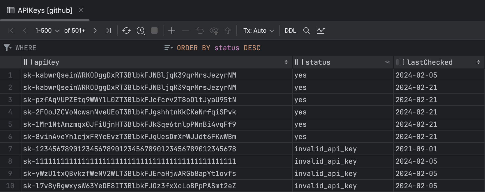
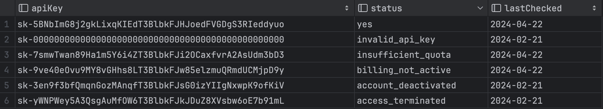
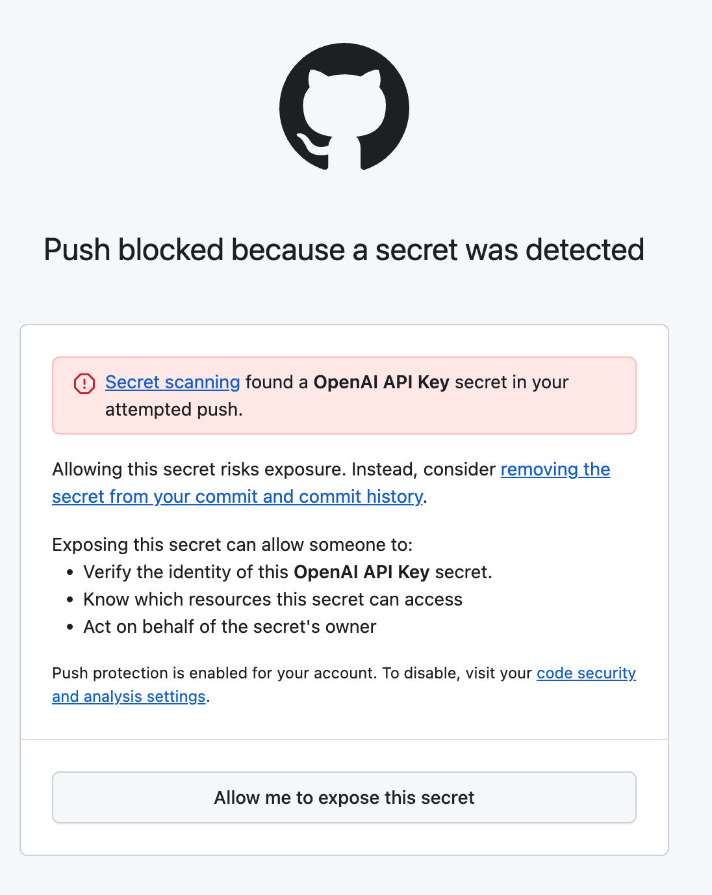

# ChatGPT-API-Leakage

This tool scans GitHub for available OpenAI API Keys.



> [!NOTE]
> As of `August 21, 2024`, GitHub has enabled push protection to prevent API key leakage, which could significantly impact this repository.

> [!NOTE]
> As of `March 11, 2024`, secret scanning and push protection will be enabled by default for all new user-owned public repositories that you create.
> Check this announcement [here](https://docs.github.com/en/code-security/getting-started/quickstart-for-securing-your-repository).

> [!WARNING]
> **⚠️ DISCLAIMER**
>
> THIS PROJECT IS ONLY FOR ***SECURITY RESEARCH*** AND REMINDS OTHERS TO PROTECT THEIR PROPERTY, DO NOT USE IT ILLEGALLY!!
>
> The project authors are not responsible for any consequences resulting from misuse.
>
> 本项目仅用于安全研究以及提醒人们注意保护个人信息，本项目禁止用于任何违法用途！！
>
> 项目作者不对任何滥用导致的后果负责。

## Keeping Your API Key Safe

It's important to keep it safe to prevent unauthorized access. Here are some useful resources:

- [Best Practices for API Key Safety](https://help.openai.com/en/articles/5112595-best-practices-for-api-key-safety)

- [My API is getting leaked.. need advice!](https://community.openai.com/t/my-api-is-getting-leaked-need-advice/280564)

- [My OpenAI API Key Leaked! What Should I Do?](https://www.gitguardian.com/remediation/openai-key)

## Prerequisites

This project has been tested and works perfectly on macOS, Windows and WSL2 (see [Run Linux GUI apps on the Windows Subsystem for Linux](https://learn.microsoft.com/en-us/windows/wsl/tutorials/gui-apps))

Ensure you have the following installed on your system:

- Google Chrome
- Python3

## Installation

1. Clone the repository:

    ```bash
    git clone https://github.com/Junyi-99/ChatGPT-API-Leakage

    cd ChatGPT-API-Leakage
    ```

2. Install required pypi packages

    ```bash
    pip install selenium tqdm openai rich
    ```

## Usage

1. Run the main script:

    ```bash
    python3 src/main.py
    ```

2. You will be prompted to log in to your GitHub account in the browser. Please do so.

That's it! The script will now scan GitHub for available OpenAI API Keys.

## Results

The results are stored in the `github.db` SQLite database, which is created in the same directory as the script.

You can view the contents of this database using any SQLite database browser of your choice.




## FAQ

**Q: Why are you using Selenium instead of the GitHub Search API?**

A: The official GitHub search API does not support regex search. Only web-based search does.

**Q: Why are you limiting the programming language in the search instead of searching all languages?**

A: The web-based search only provides the first 5 pages of results. There are many API keys available. By limiting the language, we can break down the search results and obtain more keys.

**Q: Why don't you use multithreading?**

A: Because GitHub searches and OpenAI are rate-limited. Using multithreading does not significantly increase efficiency.

**Q: Why is the API Key provided in your repository not working?**

A: The screenshots in this repo demonstrate the tool's ability to scan for available API keys. However, these keys may expire within hours or days. Please use the tool to scan for your own keys instead of relying on the provided examples.

**Q: What's the push protection?**

A: see picture.

