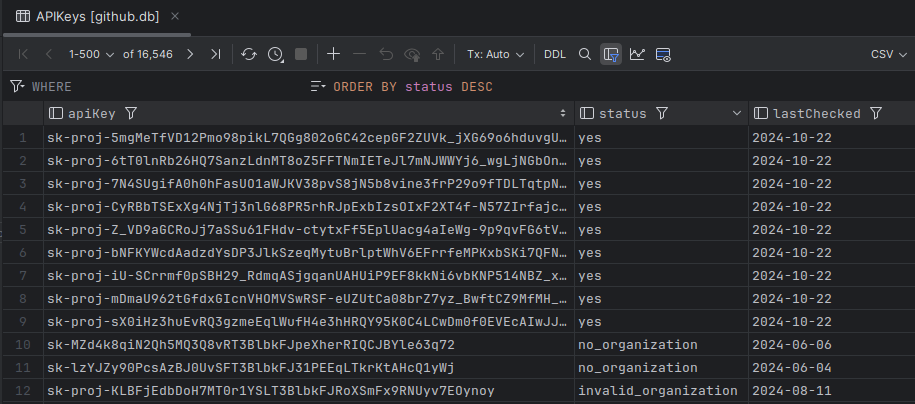

# ChatGPT-API-Leakage

This tool scans GitHub for available OpenAI API Keys.



> **⚠️ DISCLAIMER**
>
> THIS PROJECT IS ONLY FOR ***SECURITY RESEARCH*** AND REMINDS OTHERS TO PROTECT THEIR PROPERTY, DO NOT USE IT ILLEGALLY!!
>
> The project authors are not responsible for any consequences resulting from misuse.
>
> 本项目仅用于安全研究以及提醒人们注意保护个人信息，本项目禁止用于任何违法用途！！
>
> 项目作者不对任何滥用导致的后果负责。

## Keeping Your API Key Safe

It's important to keep it safe to prevent unauthorized access. Here are some useful resources:

- [Best Practices for API Key Safety](https://help.openai.com/en/articles/5112595-best-practices-for-api-key-safety)

- [My API is getting leaked.. need advice!](https://community.openai.com/t/my-api-is-getting-leaked-need-advice/280564)

- [My OpenAI API Key Leaked! What Should I Do?](https://www.gitguardian.com/remediation/openai-key)

## Prerequisites

This project has been tested and works perfectly on macOS, Windows and WSL2 (see [Run Linux GUI apps on the Windows Subsystem for Linux](https://learn.microsoft.com/en-us/windows/wsl/tutorials/gui-apps))

Ensure you have the following installed on your system:

- Google Chrome
- Python3

## Installation

1. Clone the repository:

    ```bash
    git clone https://github.com/Junyi-99/ChatGPT-API-Leakage

    cd ChatGPT-API-Leakage
    ```

2. Install required pypi packages

    ```bash
    pip install -r requirements.txt
    ```

## Usage

1. Run the main script:

    ```bash
    python3 main.py
    ```

2. You will be prompted to log in to your GitHub account in the browser. Please do so.

That's it! The script will now scan GitHub for available OpenAI API Keys.

## Results

The results are stored in the `github.db` SQLite database, which is created in the same directory as the script.

You can view the contents of this database using any SQLite database browser of your choice.


## FAQ

**Q: Why are you using Selenium instead of the GitHub Search API?**

A: Because the official search API does not support regex search. Only web-based search does.

**Q: Why are you limiting the programming language in the search instead of searching all languages?**

A: Because the web-based search only provides the first 5 pages of results. There are many API keys available. By limiting the language, we can split the search results and obtain more keys.

**Q: Why don't you use multithreading?**

A: Because GitHub searches and OpenAI are rate-limited. Using multithreading does not significantly increase efficiency.
