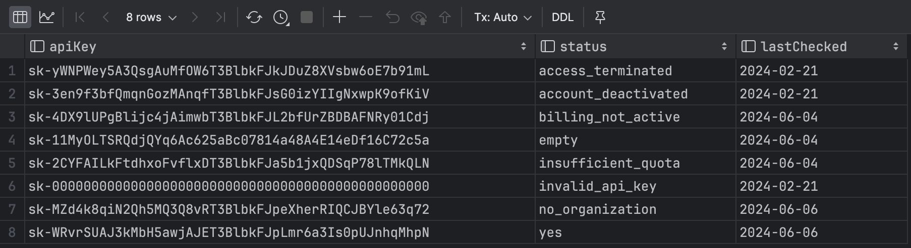

# ChatGPT-API-Leakage

This tool scans GitHub for available OpenAI API Keys.


# Prerequisites

Ensure you have the following installed on your system:

 - Google Chrome (tested)
 - Python3


## Installation

1. Clone the repository:

```bash
git clone https://github.com/Junyi-99/ChatGPT-API-Leakage

cd ChatGPT-API-Leakage
```
2. Install required pypi packages

```bash
pip install -r requirements.txt
```

# Usage

1. Run the main script:

```bash
python3 main.py
```

2. You will be prompted to log in to your GitHub account in the browser. Please do so.

That's it! The script will now scan GitHub for available OpenAI API Keys.

# Results

The results are stored in the `github.db` SQLite database, which is created in the same directory as the script.

You can view the contents of this database using any SQLite database browser of your choice.


